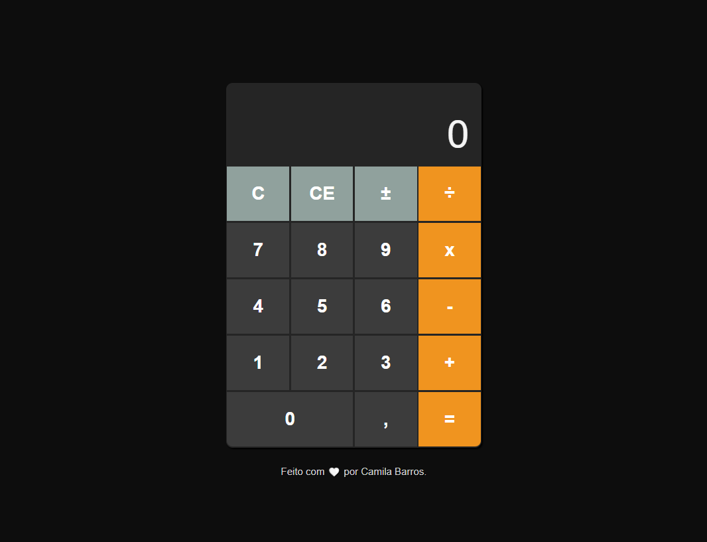

    

## 🖥️ Projeto
Miniprojeto de uma "Calculadora" de operações básicas.

## 🚀 Tecnologias
Esse projeto foi desenvolvido utilizando as seguintes tecnologias:

- HTML
- CSS
- JavaScript
- Git e Github